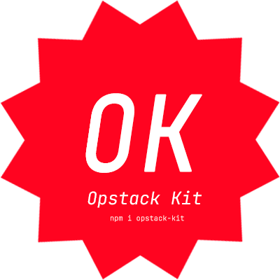
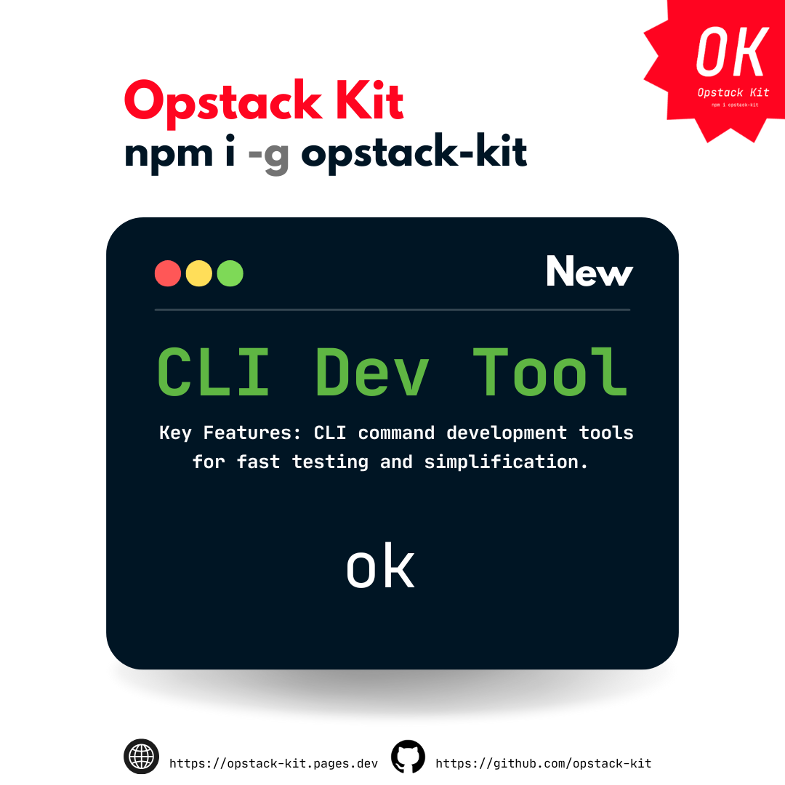

# CLI command

CLI command development tools for fast testing and simplification.

<!--  -->

<br/>

<!-- <div align="center">
  
</div> -->
<div align="center">
  <video width="800" autoplay loop muted>
    <source src="./assets/cli.mp4" type="video/mp4">
  </video>
</div>

<br/><br/>

**install**: `npm i -g opstack-kit` <br>
**call**: `ok` 
<br><br> *Note: 🟣 Required 🟡 Optional*


## depositTransaction
Deposit ETH, "OptimismPortal.[depositTransaction](https://github.com/ethereum-optimism/optimism/blob/op-contracts/v2.0.0-beta.3/packages/contracts-bedrock/src/L1/OptimismPortal.sol#L495C1-L526C6)" address.

**Command:**
```bash [npm]
ok depositTransaction <Amount>
```
Amount to Deposit

**Option:**
- 🟣 `-pk`, `--privateKey <key>`: Private key for signing the transaction
- 🟣 `-c1`, `--chainIdL1 <id>`: Chain ID for Layer 1
- 🟣 `-r1`, `--rpcUrlL1 <url>`: RPC URL for Layer 1
- 🟣 `-p`, `--portal <address>`: Portal contract address
- 🟡 `-g`, `--gasLimit <gas>`: Gas limit for Transaction, '21000'
- 🟡 `-s1`, `--scanL1Url <url>`: Block Explorer URL for Layer 1, 'undefined'

**Usage:** 
```bash [npm]
ok depositTransaction <Amount> --privateKey <key> --chainIdL1 <id> --rpcUrlL1 <url> --portal <address> --gasLimit <gas> --scanL1Url <url>
```

## initiateWithdrawal
Withdraw ETH, "L2ToL1MessagePasser.[initiateWithdrawal](https://github.com/ethereum-optimism/optimism/blob/op-contracts/v2.0.0-beta.3/packages/contracts-bedrock/src/L2/L2ToL1MessagePasser.sol#L69C1-L92C6)" address.

::: tip
For ETH Native and [CustomGasToken](./hooks/L2/useWriteInitiateWithdrawalETH.md) only.
:::

**Command:**
```bash [npm]
ok initiateWithdrawal <Amount>
```
Amount to Withdraw 

**Option:**
- 🟣 `-pk`, `--privateKey <key>`: Private key for signing the transaction
- 🟣 `-c2`, `--chainIdL2 <id>`: Chain ID for Layer 2
- 🟣 `-r2`, `--rpcUrlL2 <url>`: RPC URL for Layer 2
- 🟡 `-g`, `--gasLimit <gas>`: Gas limit for Transaction, '21000'
- 🟡 `-s2`, `--scanL2Url <url>`: Block Explorer URL for Layer 2, 'undefined'

**Usage:** 
```bash [npm]
ok initiateWithdrawal <Amount> --privateKey <key> --chainIdL2 <id> --rpcUrlL2 <url> --gasLimit <gas> --scanL2Url <url>
```

## prove (proveWithdrawal)
Prove withdrawal using transaction hash, "OptimismPortal.[proveWithdrawal](https://github.com/ethereum-optimism/optimism/blob/op-contracts/v2.0.0-beta.3/packages/contracts-bedrock/src/L1/OptimismPortal.sol#L243C1-L322C6)" address.

::: tip
Non-Fault proofs: disputeGameFactory = `0x_l2OutputOracle` <br/>
Fault proofs: l2OutputOracle = `0x_disputeGameFactory`
:::

**Command:**
```bash [npm]
ok prove <WithdrawalTxHashL2>
```
Transaction hash of the Layer 2 withdrawal

**Option:**
- 🟣 `-pk`, `--privateKey <key>`: Private key for signing the transaction
- 🟣 `-c1`, `--chainIdL1 <id>`: Chain ID for Layer 1
- 🟣 `-r1`, `--rpcUrlL1 <url>`: RPC URL for Layer 1
- 🟣 `-c2`, `--chainIdL2 <id>`: Chain ID for Layer 2
- 🟣 `-r2`, `--rpcUrlL2 <url>`: RPC URL for Layer 2
- 🟣 `-p`, `--portal <address>`: Portal contract address
- 🟣 `-o`, `--l2OutputOracle <address>`: Portal contract address
- 🟣 `-d`, `--disputeGameFactory <address>`: Dispute Game Factory contract address
- 🟡 `-s1`, `--scanL1Url <url>`: Block Explorer URL for Layer 1, 'undefined'

**Usage:** 
```bash [npm]
ok prove <WithdrawalTxHashL2> --privateKey <key> --chainIdL1 <id> --rpcUrlL1 <url> --chainIdL2 <id> --rpcUrlL2 <url> --portal <address> --l2OutputOracle <address> --disputeGameFactory <address> --scanL1Url <url>
```

## finalize (finalizeWithdrawal)
Finalize withdrawal using transaction hash after proving, "OptimismPortal.[finalizeWithdrawal](https://github.com/ethereum-optimism/optimism/blob/op-contracts/v2.0.0-beta.3/packages/contracts-bedrock/src/L1/OptimismPortal.sol#L324C1-L444C6)" address.

**Command:**
```bash [npm]
ok finalize <WithdrawalTxHashL2>
```
Transaction hash of the Layer 2 withdrawal

**Option:**
- 🟣 `-pk`, `--privateKey <key>`: Private key for signing the transaction
- 🟣 `-c1`, `--chainIdL1 <id>`: Chain ID for Layer 1
- 🟣 `-r1`, `--rpcUrlL1 <url>`: RPC URL for Layer 1
- 🟣 `-c2`, `--chainIdL2 <id>`: Chain ID for Layer 2
- 🟣 `-r2`, `--rpcUrlL2 <url>`: RPC URL for Layer 2
- 🟣 `-p`, `--portal <address>`: Portal contract address
- 🟡 `-s1`, `--scanL1Url <url>`: Block Explorer URL for Layer 1, 'undefined'

**Usage:** 
```bash [npm]
ok finalize <WithdrawalTxHashL2> --privateKey <key> --chainIdL1 <id> --rpcUrlL1 <url> --chainIdL2 <id> --rpcUrlL2 <url> --portal <address> --scanL1Url <url>
```